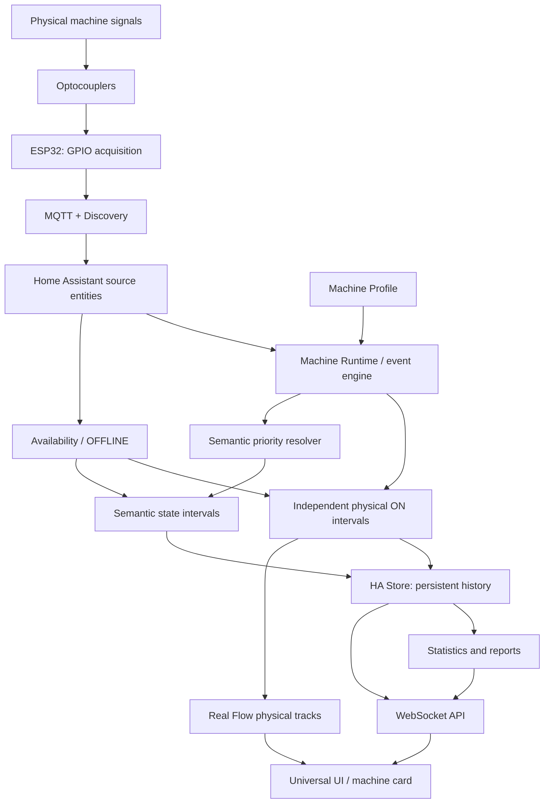

# Architecture / Архитектура

## Data boundaries

The ESP32 only observes raw inputs. It does not assign work/heating/idle meanings and does not control equipment. The HA integration consumes source entities rather than relying on an ESP32-specific event topic.

Machine Profile is the canonical configuration: input names, categories, priorities, colors, enabled/visible flags, statistics settings, row order, retention and shifts. Physical histories remain independent even when semantic priorities select only one current machine state.

OFFLINE is a historical interval of unknown activity. Availability loss closes uncertain physical ON intervals. A newly confirmed ON after recovery starts a new interval. No activity is reconstructed inside the gap.

History schema 3 stores separate `intervals` and `input_intervals`, plus observation metadata. Legacy semantic-only histories load without fabrication of missing physical data. HA Store writes are atomic and serialized outside the event loop; retention pruning runs at startup/daily and when retention decreases.

## Main modules

| Module | Responsibility |
|---|---|
| `config_flow.py`, `models.py` | Configuration and profiles |
| `coordinator.py`, `machine.py`, `event_engine.py` | Runtime, source updates and state resolution |
| `source_validation.py` | Source validation, including avoiding own diagnostic entities |
| `storage.py` | Independent persistent histories and retention |
| `stats.py`, `reports.py` | Period totals, comparisons and shifts |
| `sensor.py`, `binary_sensor.py` | HA diagnostic entities |
| `websocket_api.py` | UI data and report requests |
| `frontend_setup.py`, `dashboard.yaml` | Static module, resources and sidebar dashboard |
| `frontend/machine_monitor_card.js` | Overview, machine UI, standalone card, editor and UI localization |

## Updates

Source state changes emit integration update events. The frontend coalesces bursts with a 250 ms debounce. Polling every 5 seconds is a fallback; a local one-second timer updates displayed elapsed durations. Changing display filters, zoom or UI language does not rewrite history.

Frontend module URLs use a content hash to invalidate cached resources. Language preference is browser-local; names from Machine Profile and source IDs are preserved.

Persistent data belongs to Home Assistant `.storage` and is not part of this repository. See root `AGENTS.md` for the complete engineering specification.
